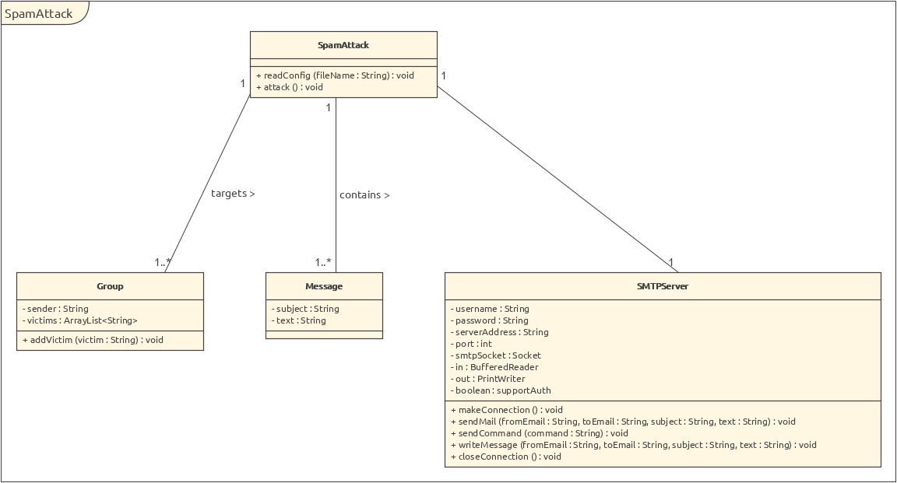

## RES - Laboratoire #2 - SMTP

#### Auteurs: Edin Mujkanovic et Daniel Paiva

#### Date:  10 avril 2019


##### 1. Introduction

Durant ce labaratoire, nous avons du implémenter un client SMTP qui se connect à un serveur SMTP afin d'envoyer des mails à des victimes. Ces dernières se trouvent toutes dans le fichier configuration. Le logiciel va créer des groupes, composées de minimum 3 victimes, dont l'une d'entre elle sera l'expéditeur, et le reste les déstinataires. Le contenu des mails sera contenu 

##### 2. Mise en place du serveur SMTP mock

Afin de mettre en place un serveur SMTP mock, il suffit d'aller dans le dossier **MockMock** situé à la racine et d'exécuter le script **start-mockmock.sh**. Ce dernier va créer une image java8 avec le fichier jar du MockMock. Après avoir executé ce script, le serveur MockMock sera atteignable sur :

- 127.0.0.1:8282 : pour le serveur web
- 127.0.0.1:2525 : pour le serveur SMTP

Afin de l'arreter, il suffit d'executer le script **stop-mockmock.sh** situé dans le même dossier.

##### 3. Clear and simple instructions for configuring your tools and running a prank campaign

Les configurations du logiciel se trouve dans un seul fichier nommé *config.xml*, ce dernier se trouve à la racine du projet. Plusieurs éléments se trouvent dans ce fichier : 

- Balise <server>: 

  Cette dernière contient les informations du serveur SMTP que le client va utiliser afin d'envoyer les mails. Le serveur est composé de : 

  - une balise <username> qui spécifie le nom d'utilisateur à envoyer au serveur SMTP afin de s'identifier. **<u>Si aucune authentification est nécessaire, il faut laisser ce champs vide.</u>**
  - une balise <password> qui spécifie le mot de passe à envoyer au serveur SMTP afin de s'identifier. **<u>Si aucune authentification est nécessaire, il faut laisser ce champs vide.</u>**
  - une balise <ip> qui spécifie l'adresse du serveur SMTP. Nous pouvons également utiliser un nom de domaine.
  - une balise <port> qui spécifie le port du serveur SMTP.

- Une balise <victims> qui contient plusieurs <victim> qui contiennent les adresses mail des destinataires. 

- Balise <messages>:

  Cette dernière est composée de plusieurs <message>, qui eux sont composés de :

  - une balise <sujet> qui contient le sujet du mail.
  - une balise <text> qui contient le texte contenu dans le corps du mail.

Afin de créer votre propre attaque, il vous suffit de modifier les informations concernant votre serveur, insérer vos victimes, et insérer vos messages. Le contenu de vos mails sera choisi aléatoirement parmi tous les messages que vous aurez prédéfinis.

```xml
<config>
    <server>
        <username></username>
        <password></password>
        <ip>127.0.0.1</ip>
        <port>2525</port>
    </server>
    <nbGroups>2</nbGroups>
    <victims>
        <victim>john.doe@example.com</victim>
        <victim>marjorie@example.com</victim>
    </victims>
    <messages>
        <message>
            <subject>You won</subject>
            <text>Click <a href="http://google.ch">here to win an iPhone XS MAX 512GB</a>			 </text>
        </message>
        <message>
            <subject>You won! </subject>
            <text>Kremelin</text>
        </message>
        <message>
            <subject>You WOOOOON</subject>
            <text>Elysée</text>
        </message>
    </messages>
</config>
```

Après avoir créer votre propre fichier de configuration, il vous faut modifier le chemin d'accès dans la méthode main de la classe *SpamAttack*.  Après avoir modifier le chemin, il faut recompiler le projet. Pour ce faire, aller dans le dossier racine du projet, et taper la commande : `mvn clean install`. Le nouvel executable se trouvera dans le dossier *target/*.

##### 4. A description of your implementation

Ci-dessous, un UML présentant l'architecture de notre logiciel : 



La classe SMTP est le principal élément de notre programme, en effet, il va contenir :

- une liste d'objet Message. Cette classe permet de contenir un message, qui est défini par un sujet et un texte.

- une liste d'objet Group. Cette classe permet de contenir un groupe, qui est défini par un "sender" qui sera le mail utilisé pour l'envoi des mails et qui est stocké dans un *String*. Une liste de *String* qui contiendra toutes les adresses mails des victimes.

- un objet SMTPServer qui est le noyau de l'attaque car il contiendra les différentes informations:

  - username: Nom d'utilisateur pour s'authentifier auprès du serveur
  - password: Mot de passe pour s'authentifier auprès du serveur
  - serverAddress: Adresse du serveur
  - port: Port du serveur
  - smtpSocket: Socket permettant de communiquer avec le serveur
  - in: Flux de lecture du serveur
  - out: Flux d'écriture du serveur
  - supportAuth: Booléan indiquant si le serveur prend en charge l'authentification

  Cette classe contient également différentes méthodes : 

  - makeConnection: permet d'initier la connection avec le serveur
  - sendMail: permet d'envoyer un mail
  - sendCommand: permet d'envoyer une commande au serveur
  - writeMessage: permet d'écrire un message
  - closeConnection: permet de fermer la connection avec le serveur